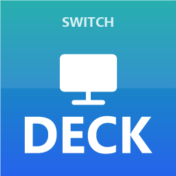

<div align="center">



# SwitchDeck

**Troque a saída de áudio, o microfone e a configuração dos monitores com um clique — ou por um botão do seu Stream Deck.**

*Switch audio output, microphone and monitor layout with one click — or from a Stream Deck button.*


</div>

---

## ✨ O que faz

- 🔊 **Saída de áudio** — troca o dispositivo padrão (define **áudio** *e* **comunicações** de uma vez).
- 🎙️ **Microfone** — troca o microfone padrão do mesmo jeito.
- 🖥️ **Perfis de monitor** — salva configurações completas de tela (quais monitores ligados, qual é o principal, posições, resolução) e reaplica com um clique. Ótimo para alternar entre "TV para jogar", "trabalho com 3 telas", etc.
- 🔗 **Áudio vinculado ao perfil** — um perfil de monitor pode, opcionalmente, já trocar o áudio junto.
- 🎛️ **Atalhos + Stream Deck** — cria atalhos na área de trabalho **e** numa pasta pronta para o Stream Deck, com **ícones PNG** gerados automaticamente.
- 🚫 **Sem flash de terminal** — as ações rodam por um lançador invisível; nenhuma janela preta pisca.

## 📦 Requisitos

- **Windows 10 ou 11**
- Nada para instalar — usa apenas o **Windows PowerShell** e o **.NET Framework** que já vêm no Windows.

## 🚀 Instalação

1. Baixe o projeto (**Code → Download ZIP**) e **extraia** numa pasta com permissão de escrita (ex.: `Documentos\SwitchDeck`).
2. Dê dois cliques em **`Instalar.cmd`**.
   - Ele desbloqueia os arquivos, compila os componentes nativos e cria um atalho **SwitchDeck** na Área de Trabalho.
3. Abra o app pelo atalho **SwitchDeck**.

> Na primeira execução o Windows pode pedir confirmação (SmartScreen) por ser um app novo — é seguro, o código é aberto.

## 🖱️ Como usar

Abra o **SwitchDeck** e use as três abas:

| Aba | O que fazer |
|-----|-------------|
| **Saída de Áudio** | Selecione um dispositivo → **Definir como padrão** (ou dê duplo-clique). **Criar atalho** gera o atalho + ícone. |
| **Microfone** | Igual, para os microfones. |
| **Monitores** | Arrume as telas nas *Configurações do Windows*, depois **Capturar tela atual** para salvar um perfil. **Aplicar** reproduz o perfil. **Criar atalho** para acioná-lo direto. |

### 🎛️ Usando no Stream Deck

Todo atalho criado também vai para a pasta **`data\shortcuts`** (o botão *Abrir pasta de atalhos* te leva lá). No software do seu Stream Deck:

1. Ação **Abrir / Executar programa** apontando para o `.lnk` da pasta.
2. Defina a imagem do botão usando o **PNG** correspondente em `data\icons`.

## 🔎 Código aberto e reproduzível

Tudo aqui é **código-fonte legível** — nenhum binário "caixa-preta" baixado de lugar nenhum. Os únicos executáveis (`bin\RunHidden.exe` e `bin\SwitchDeck.Native.dll`) são **compilados na sua máquina** a partir de `src\RunHidden.cs` e `src\Native.cs` na primeira execução (ou ao rodar `Instalar.cmd`). Você pode ler, auditar e modificar cada linha.

Compilar manualmente, se quiser (opcional):

```powershell
# Lançador sem janela
Add-Type -Path .\src\RunHidden.cs -OutputAssembly .\bin\RunHidden.exe -OutputType WindowsApplication
# Componentes nativos (áudio + monitores)
Add-Type -Path .\src\Native.cs -OutputAssembly .\bin\SwitchDeck.Native.dll
```

## 🧠 Como funciona (técnico)

- **Áudio**: enumera os endpoints via `IMMDeviceEnumerator` e define o padrão via a interface (não documentada, mas estável) `IPolicyConfig::SetDefaultEndpoint` para os papéis *Console*, *Multimídia* e *Comunicações*. Os atalhos identificam o dispositivo pelo **nome** (estável), não pelo GUID do endpoint — que pode mudar após updates do Windows/driver. Se o dispositivo não estiver ativo (desligado/desconectado), avisa em vez de dar erro.
- **Monitores**: usa a **API CCD** moderna (`QueryDisplayConfig` / `SetDisplayConfig`) — a mesma das Configurações do Windows. Um perfil é o retrato binário dos *paths/modes* ativos; ao aplicar, o `adapterId` (LUID) é re-carimbado, pois ele muda a cada reinício.
- **Sem flash**: `RunHidden.exe` é um app de subsistema *Windows* (sem console) que inicia o PowerShell invisível.
- Os componentes nativos ficam num único `src\Native.cs`, compilado para `bin\SwitchDeck.Native.dll` na primeira execução (carregamento rápido depois).

> ⚠️ **Por que não usar a API antiga?** Em muitos PCs com Windows 11 a API legada (`ChangeDisplaySettingsEx`) e ferramentas que dependem dela **reportam sucesso mas não mudam nada**. Por isso o SwitchDeck usa exclusivamente a API CCD.

## 📁 Estrutura

```
SwitchDeck/
├─ SwitchDeck.ps1      # entrada da interface
├─ Run.ps1             # executor das ações (chamado pelos atalhos)
├─ Install.ps1         # instalação
├─ Instalar.cmd        # instalador (duplo-clique)
├─ SwitchDeck.cmd      # abre o app direto
├─ src/
│  ├─ Core.ps1         # áudio, perfis, ícones, atalhos
│  ├─ Gui.ps1          # interface WinForms
│  ├─ Native.cs        # código nativo (áudio + CCD)
│  └─ RunHidden.cs     # lançador sem janela
├─ bin/                # binários compilados (gerados)
└─ data/               # perfis, ícones e atalhos (gerados)
```

## ⚠️ Limitações conhecidas

- Perfis de monitor assumem **uma única GPU** no re-carimbo do LUID (cobre a maioria dos PCs). Multi-GPU pode exigir recapturar o perfil.
- Se você trocar de cabo/porta dos monitores, recapture o perfil.

## 📝 Licença

MIT — veja [LICENSE](LICENSE). Use, modifique e compartilhe à vontade.
